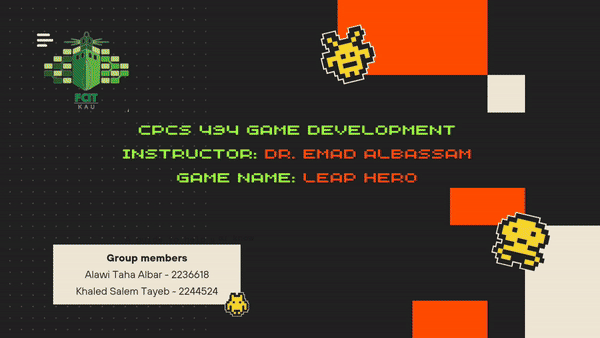

# Leap Hero 🏃‍♂️

A 2D parkour platformer built in **Unity (C#)**. The player leaps across moving and
disappearing platforms, dodges shooting enemies, collects gems and power-ups, and
races to the end of each level — all while managing a health bar and fall damage.

> Coursework project for CPCS 494 (Game Development) at King Abdulaziz University.

## Gameplay Preview


▶ **[Watch the full gameplay video](media/leap-hero-gameplay.mp4)** (720p, ~5 MB)

## Gameplay Features
- **Responsive platforming** — custom player movement, camera follow, and fall-damage system.
- **Dynamic platforms** — floating, horizontal-moving, and sticky platforms that change how you traverse each level.
- **Enemies** — patrolling enemies that detect the player and shoot projectiles.
- **Collectibles & power-ups** — gems, apples, and a speed-boost pickup.
- **UI & menus** — main menu, options menu, and an in-game health bar.
- **Audio** — centralized audio manager for music and sound effects.
- **2 playable levels** with a level-end goal.

## Tech
- **Engine:** Unity (2D, URP)
- **Language:** C#
- **Input:** Unity Input System
- **UI:** TextMesh Pro

## Project Structure
```
Assets/
├── Scripts/        # Gameplay code (player, enemies, platforms, pickups, UI, audio)
├── Animations/     # Character and object animations
├── Scenes/         # Level scenes
└── (art, fonts, audio packs)
```

Key scripts include `PlayerMovement`, `PlayerHealth`, `PlayerFallDamage`,
`CameraFollow`, `EnemyShootAndDetect`, `AudioManager`, `HealthBarUI`, and the
platform behaviours (`FloatingPlatform`, `PlatformHorizontal`, `StickyPlatform`).

## Running the Project
1. Open the folder in **Unity Hub** (Unity 2022 LTS or newer recommended).
2. Open the main menu scene under `Assets/Scenes/`.
3. Press **Play**.

> Note: Unity-generated folders (`Library/`, `Temp/`, `Logs/`) are intentionally
> excluded via `.gitignore`. Unity regenerates them automatically on first open.

## Author
**Alawi Taha Albar** — Computer Science, King Abdulaziz University
[GitHub](https://github.com/JusttApp) · [LinkedIn](https://www.linkedin.com/in/alawy-albar-915a1726b)
